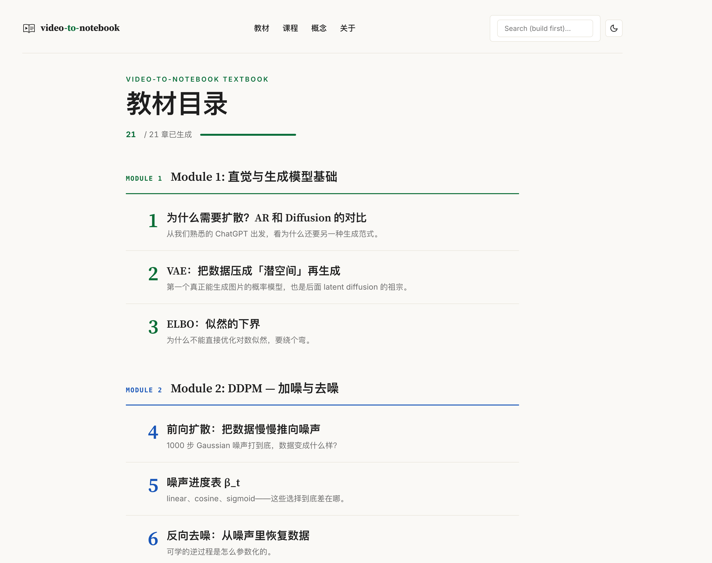
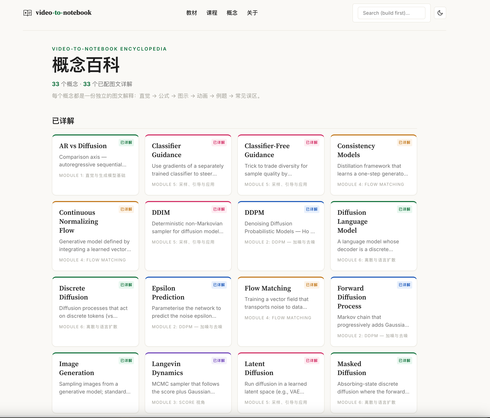
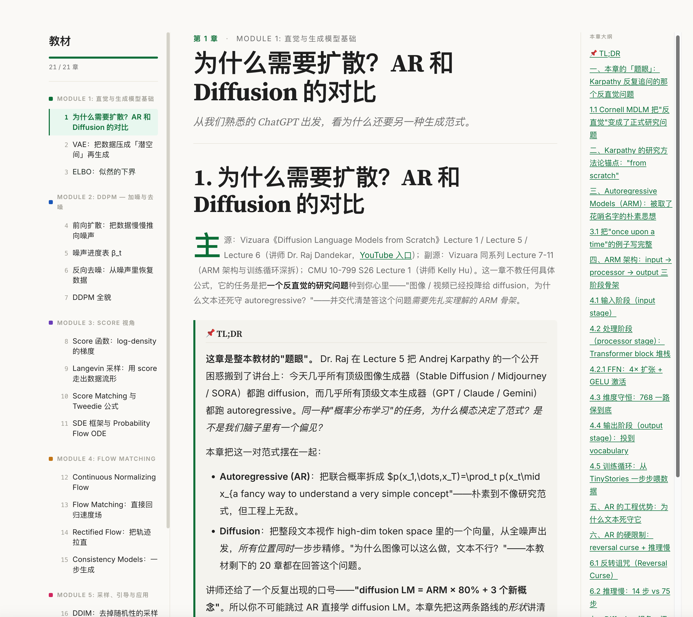

<div align="center">

<picture>
  <source media="(prefers-color-scheme: dark)" srcset="assets/logo/lockup-dark.svg" />
  
</picture>

**Built for Claude Code & OpenAI Codex.** Read open-course videos as one merged notebook — textbook + concept encyclopedia in a single static site.

Point it at a few **YouTube or Bilibili** playlists on the same topic. Your coding agent does the heavy lifting — crawls the videos, tags every transcript chunk against your ontology, clusters them into a clean concept graph, designs a pedagogical chapter order, and writes each chapter + concept page. **No separate Anthropic API key required**: every LLM stage runs in-session through your agent's existing Claude Code or Codex subscription. Pagefind search and bilingual (中文 / English) output ship at the flip of a flag.

[](https://github.com/LinZhuoChen/video-to-notebook/actions/workflows/ci.yml)
[](https://www.python.org/)
[](LICENSE)
[](https://astro.build/)
[](https://claude.com/claude-code)
[](https://github.com/openai/codex)

[**Live demo: Diffusion Models 教材**](https://linzhuochen.github.io/video-to-notebook/textbook/) · [**Quickstart**](#-quickstart) · [**How it works**](#-how-it-works) · [**Use with Claude Code / Codex / any agent**](#-drive-it-from-your-ai-coding-agent) · [**Roadmap**](#-roadmap)

**English** · [中文](README.zh-CN.md)

---

</div>

> 🚧 **Early days — expect rough edges.** `video-to-notebook` is in active development; v2.0.0 is the first public release after the `course-merger` → `video-to-notebook` rename. If you hit a bug, a confusing prompt, an off-target chapter, or a crawler that refuses to play nicely with a real playlist, please [**open an issue**](https://github.com/LinZhuoChen/video-to-notebook/issues/new/choose) with the failing command + a few lines of log — that's by far the fastest way to get it fixed. Feature requests, ontology files for new domains, and crawler adapters for platforms beyond YouTube + Bilibili (Coursera, edX, MIT-OCW, …) are all welcome too.

## ✨ What you get

<table>
<tr>
<td width="50%" valign="top" align="center">
<a href="https://linzhuochen.github.io/video-to-notebook/textbook/">
  
</a>
<sub><b>📖 Textbook TOC</b> — 21 chapters, 5 modules, pedagogical order</sub>
</td>
<td width="50%" valign="top" align="center">
<a href="https://linzhuochen.github.io/video-to-notebook/concepts/">
  
</a>
<sub><b>💡 Concept encyclopedia</b> — 33 illustrated entries, per-module accent</sub>
</td>
</tr>
<tr>
<td colspan="2" align="center">
<a href="https://linzhuochen.github.io/video-to-notebook/textbook/1/">
  
</a>
<sub><b>📐 Chapter reading view</b> — left sidebar TOC · TL;DR callout · right mini-map · source-clip deep links</sub>
</td>
</tr>
</table>

## 🧭 Design principles

What separates `video-to-notebook` from "feed playlists to ChatGPT, ask for a summary":

1. **Source fidelity first.** Every chapter and concept page must faithfully transmit how the lecturer *actually* taught the idea — the exact analogies, the whiteboard derivation steps, the verbatim phrasings, the named citations. Your own framing is layered on top with an explicit `🟡 教材外补充` flag. If two courses give different metaphors for the same concept, both get preserved and labelled. If a reader who watched the lectures doesn't recognise the chapter, the system over-generalised.

2. **No fabrication — debug the pipeline instead.** When the source chunks for a chapter come up thin (e.g. all 20 chunks are course-logistics chatter, or one alphabetically-early course dominates the LIMIT), the agent is required to **stop and diagnose** rather than paper over the gap with training-data knowledge. Common bugs to check: chunk-selection SQL with `LIMIT 20 ORDER BY course_slug` (now fixed via depth-first allocation), tagging that matched by lecture-title keyword without the concept being discussed, `--max-source-chunks` too low.

3. **Textbook-note depth, not magazine-summary depth.** Each chapter targets ~5,000–8,000 中文字 with: a TL;DR callout block, 8–14 numbered sections (一二三四 …), step-by-step math derivations where every line has a `**Why**:` annotation, all distinctive lecturer analogies preserved, 3–5 colour-coded callouts (info/note/warning/tip/quote), engineering details embedded as inline callouts (not deferred), a complete runnable PyTorch skeleton when a model is introduced, and 5–7 takeaways anchored to specific lecturer-given examples. Under 4,000 字 = under-developed.

These three rules live inside the [synthesize](src/video_to_notebook/synthesize/prompts.py) and [explain](src/video_to_notebook/explain/prompts.py) style guides, so any agent driving the pipeline inherits them automatically.

## 📸 Showcase

<table>
<tr>
<td width="50%" valign="top">

### 📖 Merged textbook

Chapters laid out in pedagogical order — your beginner reads top-to-bottom and gets a complete arc, not a mosaic of fragments.

- Inline SVG figures + CSS animations
- KaTeX-rendered LaTeX math
- Embedded source-video clips with timestamps
- Anti-bias opener + 3 takeaways per chapter
- ← / → keyboard nav · 📊 mini-map sidebar

</td>
<td width="50%" valign="top">

### 💡 Concept encyclopedia

Every important concept gets its own rich page — for the reader who wants depth on one idea.

- Definition / formula / pitfall **quickref card**
- Interactive widgets: sliders, step-buttons, animated SVG
- Worked numerical example with equation chain
- 3 counter-example misconceptions
- Cross-links to related concepts
- Source-clip deep links

</td>
</tr>
<tr>
<td width="50%" valign="top">

### 🌓 Dark mode + per-module accent

```
Module 1  · Math intuition       🟢 green
Module 2  · Training intuition   🔵 blue
Module 3  · Vision origins       🟣 purple
Module 4  · Modern deep learning 🟡 amber
Module 5  · Architecture + future 🌸 rose
```

Auto-applied via `data-module-idx` on layout root. Cards, sidebars, drop caps, progress bars all inherit `--module-accent`.

</td>
<td width="50%" valign="top">

### 📱 Mobile-first, no JS framework

```
@media (max-width: 900px)
  → hamburger drawer slides in from left
  → textbook sidebar mirrors inside drawer
  → reading column expands to full viewport
```

No React, no Vue. Astro + 200 lines of vanilla JS. The whole concept page weighs ~30 KB gzipped (including SVG + interaction).

</td>
</tr>
</table>

## 🚀 Quickstart

### Option A — no API key, drive from an AI agent

Every LLM stage (`tag`, `cluster`, `curriculum`, `synthesize`, `explain`) has `--print-prompts` / `--apply-results` flags. Drive the pipeline from inside **Claude Code**, **OpenAI Codex**, **Cursor**, **Continue**, or your own script — no separate API key needed. See [**§ Drive it from your AI coding agent**](#-drive-it-from-your-ai-coding-agent) below for setup.

### Option B — with an Anthropic API key

```bash
# Install the CLI (Python 3.12+)
pip install video-to-notebook      # or: uv tool install video-to-notebook
brew install node yt-dlp       # Node 20+ for the build, yt-dlp for crawling

# Run the pipeline
export ANTHROPIC_API_KEY=sk-ant-...
mkdir my-study-site && cd my-study-site

video-to-notebook init --language en                                # or `--language zh` (default)

# YouTube playlist
video-to-notebook crawl "https://www.youtube.com/playlist?list=PLxxx" --name cs336

# Bilibili — single video, season list, or series. Cookies required (see § Bilibili below).
video-to-notebook crawl "https://www.bilibili.com/video/BVxxx/" --name vizuara-llm --cookies-from chrome

video-to-notebook tag      --ontology examples/ontology-llm.yaml  # ~$0.10/course
video-to-notebook cluster  --ontology examples/ontology-llm.yaml  # ~$0.30/run
video-to-notebook build
video-to-notebook serve    # http://localhost:4321
```

Total cost for a 5-course corpus: **~$2-4** first run, **$0** on re-runs (idempotent).

## 🏗 How it works

Everything orbits around a **single SQLite file** under `.video-to-notebook/` that every stage reads from and writes to. Stages are independent CLI commands, so you can re-run any one of them without touching the others.


Each subcommand is **idempotent and resumable**:

- Add a new course → only that course gets crawled / tagged.
- Re-run `cluster` → picks up new proposed tags, doesn't re-process settled ones.
- `build --incremental` → re-renders only what changed.

**Output is a static site** — deploy anywhere (GitHub Pages, S3, Vercel, Netlify, your own nginx).

## 📦 Install

```bash
# 1. Python CLI (3.12+)
pip install video-to-notebook
# or: uv tool install video-to-notebook

# 2. External requirements
brew install node yt-dlp       # Node 20+ for the HTML build; yt-dlp for crawling
playwright install chromium    # only if running e2e tests

# 3. (Optional) Whisper fallback for videos without published captions
pip install 'video-to-notebook[whisper]'   # mlx-whisper on macOS + faster-whisper everywhere
```

### 🎤 Crawling videos without subtitles

When a video has no published captions, pass `--whisper` to `crawl` and the pipeline downloads the audio, transcribes it locally (`mlx-whisper` on Apple Silicon, `faster-whisper` on Linux/Windows), and feeds the synthesised VTT into the same chunk pipeline. No API key, no network round-trip after the audio download.

```bash
video-to-notebook crawl "https://www.bilibili.com/video/BV..." \
  --name my-course \
  --cookies-from edge \
  --whisper \
  --whisper-lang zh        # optional: skip auto-detect, hint Chinese
# done: 12 ok, 8 via whisper, 0 no-subs, 0 errors
```

`--whisper-model` overrides the default. On mlx the default is **`mlx-community/whisper-large-v3-turbo`** — large-v3 distilled, ~800 MB weights, ~2× real-time on M-series. Empirically this is the sweet spot for bilingual lectures: produces Simplified Chinese with natural punctuation (vs. `small` which tends to emit Traditional Chinese and drop all punctuation). For absolute best accuracy on English technical terms, pass `--whisper-model mlx-community/whisper-large-v3-mlx` (~3 GB, ~1× real-time). On faster-whisper the default is `small`; pass `large-v3` for the same quality bump.

### 📺 Bilibili: season playlists & cookie auth

The Bilibili crawler accepts three URL shapes, all of them properly enumerated by `crawl`:

| URL shape | Example | Behaviour |
|---|---|---|
| Single video (multi-part) | `https://www.bilibili.com/video/BVxxx/` | Each `?p=N` becomes one lecture |
| Space season list | `https://space.bilibili.com/<uid>/lists/<id>?type=season` | Each entry is a separate BV; resolves to its own canonical video page |
| Series / fav list | `https://space.bilibili.com/<uid>/channel/seriesdetail?sid=<id>` | Same as season |

**Authentication**: Bilibili requires logged-in cookies for both playlist enumeration and audio download. Two options:

```bash
# A) Read cookies from a browser session (simplest if it works)
video-to-notebook crawl "<bilibili-url>" --name <slug> --cookies-from chrome --whisper

# B) Use a manually-exported cookies.txt (most portable — works around
#    macOS Keychain blocking yt-dlp from decrypting Chrome v10 cookies,
#    and survives bilibili's aggressive anti-scraping that breaks
#    unauthenticated requests with HTTP 412)
video-to-notebook crawl "<bilibili-url>" --name <slug> \
    --cookies-file ~/path/to/bilibili-cookies.txt --whisper
```

For option B, install a Chrome extension like **"Get cookies.txt LOCALLY"**, navigate to `bilibili.com` while logged in, export Netscape-format cookies. Save **outside** `~/Downloads`, `~/Desktop`, `~/Documents` (those are TCC-protected on macOS and yt-dlp can't read them) — `~/note/`, `~/code/`, or any subfolder of `~/Documents/` (not `~/Documents/` itself) all work.

### Upgrading from `course-merger` (v1.x)?

In **v2.0.0** the project was renamed from `course-merger` to `video-to-notebook`. Existing projects migrate in three commands — no re-crawl, no re-tag, the SQLite schema is unchanged:

```bash
# inside the project directory
mv .course-merger .video-to-notebook       # rename the marker
uv tool upgrade video-to-notebook          # or: pip install -U video-to-notebook
video-to-notebook build                    # back to work
```

The `course-merger` binary still exists as a back-compat shim — it prints a one-line deprecation notice and forwards to `video-to-notebook`. Scheduled for removal in v3.0.0. See [`CHANGELOG.md`](CHANGELOG.md#200--2026-05-15) for the full rationale.

## 🤖 Drive it from your AI coding agent

Every LLM stage supports a **`--print-prompts` / `--apply-results`** two-phase flow. The CLI emits a JSON envelope of pending work; the agent reads it, reasons, writes a results JSON; the CLI applies that to SQLite. The protocol is **agent-agnostic** — schemas + conventions live in [`docs/AGENT_PROTOCOL.md`](docs/AGENT_PROTOCOL.md).

<table>
<tr>
<td width="50%" valign="top">

### 🟠 Claude Code

```bash
git clone https://github.com/LinZhuoChen/video-to-notebook.git
bash video-to-notebook/skills/video-to-notebook/scripts/install-locally.sh
```

Then in Claude Code:

> Build me a study site from these courses: `<playlist1>` `<playlist2>` `<playlist3>` using `examples/ontology-llm.yaml`.

Full skill manifest at [`skills/video-to-notebook/SKILL.md`](skills/video-to-notebook/SKILL.md). Claude Max users skip the Anthropic API key entirely — the in-session flow covers tag/cluster/curriculum/synthesize/explain.

</td>
<td width="50%" valign="top">

### 🔵 OpenAI Codex

```bash
git clone https://github.com/LinZhuoChen/video-to-notebook.git
cd my-study-site
bash video-to-notebook/skills/video-to-notebook/scripts/install-codex.sh
codex                  # Codex reads AGENTS.md
```

Or install globally so Codex knows about video-to-notebook from anywhere:

```bash
bash video-to-notebook/skills/video-to-notebook/scripts/install-codex.sh --global
```

Codex reads [`AGENTS.md`](AGENTS.md) (Codex's equivalent of CLAUDE.md) and [`docs/AGENT_PROTOCOL.md`](docs/AGENT_PROTOCOL.md). Same in-session flow.

</td>
</tr>
<tr>
<td width="50%" valign="top">

### 🟣 Cursor / Continue / Aider / your own script

Any agent that reads JSON, reasons, writes JSON can drive the pipeline. The [`AGENTS.md`](AGENTS.md) + [`docs/AGENT_PROTOCOL.md`](docs/AGENT_PROTOCOL.md) pair is the contract — no Claude-specific assumptions.

When writing the results envelope, set the agent-id (`tagger_model_id`, `synthesizer`, etc.) to a string that identifies you — `cursor:v1`, `continue:v1`, `my-script:v1`. Persisted in the DB so audits work.

</td>
<td width="50%" valign="top">

### ⚙️ Plain API key

If you don't use an agent, set `ANTHROPIC_API_KEY` and run `tag` + `cluster` without `--print-prompts`. They'll call the Anthropic API directly with prompt caching. ~$0.30-0.80 per course.

The textbook-generation stages (`curriculum`, `synthesize`, `explain`) currently only work via the in-session flow — they're built for an agent's reasoning, not one-shot API calls.

</td>
</tr>
</table>

### 📋 In-session flow (any agent)

```
agent says        "Crawl this playlist and tag using examples/ontology-llm.yaml."

CLI loop:
  video-to-notebook init && video-to-notebook crawl <url>
  for batch in chunks_of(20):
    video-to-notebook tag --print-prompts --limit 20 > p.json
    agent reads p.json, writes r.json
    video-to-notebook tag --apply-results r.json
  video-to-notebook cluster --print-prompts > c.json
  agent reads c.json, writes c-apply.json
  video-to-notebook cluster --apply-results c-apply.json
  same for curriculum / synthesize (per chapter) / explain (per concept)
  video-to-notebook build
```

### Cost & speed trade-offs

|                          | API key mode | In-session mode |
|--------------------------|--------------|------------------|
| API key required         | ✅ yes       | ❌ no            |
| Cost for demo corpus     | ~$2-4       | $0 extra (covered by your agent's subscription) |
| Speed for 1000 chunks    | ~5-10 min   | ~1-2 hours       |
| Speed for 100 chunks     | ~30 sec     | ~5-10 min        |
| Curriculum / synthesize / explain | ❌ not available | ✅ this is the only mode |
| Best for                 | Large corpora, one-shot batch | Small/medium corpora + textbook generation |

## 📖 Textbook generation (v1.2+)

After `tag` + `cluster`, synthesize the corpus into a merged textbook:

```bash
# 1. Design the chapter sequence (in-session in Claude Code)
video-to-notebook curriculum --print-prompts > curr.json
# Claude reads curr.json, designs the chapter order, writes curr-results.json
video-to-notebook curriculum --apply-results curr-results.json

# 2. The agent asks you: batch mode or chapter-by-chapter?
#    - 整本批量做: loops through all N chapters, applies as it goes, build once.
#                 Best for re-runs once you trust the style.
#    - 一章一章来: synthesizes chapter 1, builds, hands control back so you can
#                 inspect /textbook/1/ and give feedback before chapter 2.
#                 Best for the first run on a new corpus.

# 3. For each chapter (whichever mode):
video-to-notebook synthesize --chapter N --print-prompts > chN.json
# Agent reads + writes /tmp/chN.html following the v3 style guide:
#   - TL;DR callout at the top + 8–14 numbered sections (一二三四 …)
#   - Step-by-step derivations with **Why**: annotations per line
#   - All distinctive lecturer analogies preserved (don't collapse to one)
#   - 3–5 callout boxes (info/note/warning/tip/quote) inline
#   - Engineering details embedded as callouts, not deferred
#   - Complete PyTorch skeleton when a model is introduced
#   - 5–7 takeaways anchored to lecturer-given examples
#   - Target body length: 5,000–8,000 中文字 per chapter
video-to-notebook synthesize --chapter N --apply-results apply-chN.json

# 4. Build & view
video-to-notebook build
video-to-notebook serve  # http://localhost:4321/textbook/
```

Each chapter is a self-contained HTML fragment with inline SVG, CSS animations, embedded source-video iframes (timestamp-deep-linked), LaTeX math (KaTeX-rendered), and colour-coded callout boxes. The v3 style guide (`src/video_to_notebook/synthesize/prompts.py`) enforces the source-fidelity + textbook-note-depth principles automatically — any agent driving the pipeline inherits them.

## 💡 Concept encyclopedia (v1.3+)

Linear textbooks are great for first-time readers. The concept encyclopedia is for the reader looking up *one* idea in depth:

```bash
video-to-notebook explain --concept linear-algebra --print-prompts > la.json
# Claude writes /tmp/la.html following the v2 style guide:
#   - per-concept CSS namespace prefix (la-)
#   - CSS-variable-only colors (works in light + dark + per-module accent)
#   - 9 fixed sections in order
#   - one of 3 interactive widget templates
video-to-notebook explain --concept linear-algebra --apply-results la-results.json

video-to-notebook build  # /concepts/<slug>/ now serves the rich explainer
```

The v2 style guide in [`src/video_to_notebook/explain/prompts.py`](src/video_to_notebook/explain/prompts.py) enforces:

- **Anti-bias opener** every entry must begin by naming a common misunderstanding and correcting it
- **One-invariant rule** every animation/interaction must make exactly ONE invariant visible
- **Equation-chain rule** every formula shows the substitution chain (no "可以推出 X")
- **Counter-example pitfalls** each of 3 misconceptions must include a specific numerical or visual counter-example
- **See-also constraint** all linked slugs must exist in `related_concepts` envelope

## 🎨 Site features

The built site (`video-to-notebook build && video-to-notebook serve`) ships with:

| Feature | What it does |
|---|---|
| 🌓 **Dark mode** | `html.dark` class + `prefers-color-scheme` fallback; toggle in header; `localStorage` persistence |
| 🎨 **Per-module accent** | Green / blue / purple / amber / rose, scoped via `data-module-idx`; cards, sidebars, drop caps all inherit |
| 📊 **Chapter mini-map** | Right rail tracks `h2`/`h3` headings with `IntersectionObserver`; click to scroll-anchor |
| ⌨️ **Keyboard nav** | `←` / `→` step through chapters; ignored in inputs; floating hint chip |
| 📱 **Mobile drawer** | Hamburger button <900 px opens slide-in panel; mirrors textbook sidebar; Escape/backdrop closes |
| 🔍 **Search** | Client-side via [Pagefind](https://pagefind.app/) |
| 🧮 **LaTeX math** | [KaTeX](https://katex.org/) auto-renders `$...$` inline / `$$...$$` block |
| 🎬 **Video deep links** | Every concept page lists source clips with timestamp-deep-linked iframes |

## 💵 Cost reality check

Per course (50-100 lectures, ~1500 chunks):

| Stage | Model | Cost |
|-------|-------|------|
| Crawl | n/a (yt-dlp) | $0 |
| Tag | Claude Haiku (prompt caching) | ~$0.10-0.30 |
| Cluster | Claude Sonnet | ~$0.20-0.50 |
| Curriculum | in-session Claude | $0 extra |
| Synthesize (per chapter) | in-session Claude | $0 extra |
| Explain (per concept) | in-session Claude | $0 extra |
| Build | n/a (Astro) | $0 |
| **Total per course** | | **~$0.30-0.80** |

For a 5-course corpus expect ~$2-4 first run. Re-runs are free thanks to per-chunk idempotency.

## 📐 Customize for your own corpus

The `examples/frontier-notebook/` directory is the recommended starting point:

```bash
cp -r examples/frontier-notebook examples/my-corpus
# Edit examples/my-corpus/courses.toml and examples/my-corpus/ontology.yaml
bash examples/my-corpus/build.sh
```

The build script chains crawl/tag/cluster/build, reads `courses.toml`, and lands a working site at `examples/my-corpus/.video-to-notebook-project/site/dist/`.

## 🗺 Roadmap

**Shipped:** v1.0 foundation · v1.1 in-session mode · v1.2 textbook generator · v1.3 concept encyclopedia + design-system polish · v1.4 multi-agent support (Codex + Cursor + Continue alongside Claude Code) · v2.0 project renamed to `video-to-notebook`, source-fidelity + textbook-depth quality discipline, chapter chunk-selection regression fixed, full zh/en i18n on prompts + Astro UI, automatic template overlay-sync on every `build` · v2.1 Whisper fallback — videos without published captions transcribe locally via `mlx-whisper` (Apple Silicon) or `faster-whisper` (cross-platform), feeding the synthesised VTT back into the same chunk pipeline · **v2.1.1 robust Bilibili** — season / list / series URLs now resolve to per-BV canonical pages (fixed silent dedup bug where every entry got the same audio); new `--cookies-file <path>` flag for Netscape-format cookies.txt, working around macOS Keychain blocking and bilibili's 412 anti-scraping; tested end-to-end on a real 14-video 8-hour B站 course (see [CHANGELOG.md](CHANGELOG.md)).

**Deferred:**
- [ ] **Live filter on compare view** client-side `?courses=cs336,gpu-mode` selection
- [ ] **`review` CLI** human-in-the-loop dispatch for `ambiguous` cluster decisions
- [ ] **Multi-language concept aliasing** dedicated Chinese ↔ English concept name pairs (current i18n covers UI + generated prose, not slug-level aliasing)

## 🏛 Architecture & design

- Design spec: [`docs/specs/2026-05-09-video-to-notebook-skill-design.md`](docs/specs/2026-05-09-video-to-notebook-skill-design.md)
- Implementation plans (TDD-decomposed):
  - Plan 1: [Foundation + Crawl](docs/superpowers/plans/2026-05-09-plan-1-foundation-and-crawl.md)
  - Plan 2: [Tag + Cluster](docs/superpowers/plans/2026-05-09-plan-2-tag-and-cluster.md)
  - Plan 3: [Build + HTML](docs/superpowers/plans/2026-05-09-plan-3-build-and-html.md)
  - Plan 4: [Demo + Deploy + Skill](docs/superpowers/plans/2026-05-09-plan-4-demo-deploy-skill.md)
  - Plan 6: [Textbook generator](docs/superpowers/plans/2026-05-13-plan-6-textbook-generator.md)
  - Plan 7: [Bilingual demo](docs/superpowers/plans/2026-05-19-plan-7-bilingual-demo.md)

## ⚖️ Disclaimer

`video-to-notebook` is a **tool**. The user is responsible for ensuring they have the right to crawl, process, and redistribute any content fed through this pipeline. This includes YouTube / Bilibili Terms of Service governing programmatic content access, the original creator's license on the lecture content, and fair use / transformative use considerations in the user's jurisdiction.

The tool's authors disclaim responsibility for content generated by users. **Personal study use is generally low risk. Public redistribution or commercial use of synthesized content may not be.** Consult the source materials' licenses before going beyond personal use.

## 🤝 Contributing

See [CONTRIBUTING.md](CONTRIBUTING.md). PRs welcome — particularly new crawler adapters and ontology files for non-AI/CS domains.

## 📄 License

[MIT](LICENSE) — see file for details.

---

<div align="center">

Made with 🤖 + ☕ by [chenlinzhuo](https://github.com/chenlinzhuo).
Built atop [Claude Code](https://claude.com/claude-code), [Astro](https://astro.build/), [yt-dlp](https://github.com/yt-dlp/yt-dlp), [Pagefind](https://pagefind.app/), [KaTeX](https://katex.org/).

If `video-to-notebook` saved you a weekend of YouTube / Bilibili binging, give it a ⭐ on GitHub.

</div>
